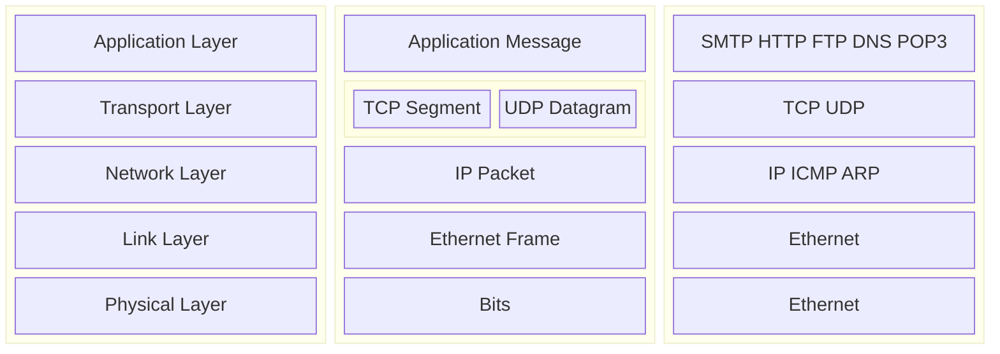

# CS3873 - Assignment 1

**Author:** Shahriar Kariman

*Due:* 2025-01-23

## Question 1 - Five Layers of the Internet Protocol Stack

The TCP/IP network model is a 5 layer model:

And the router processes the Network layer since it containes the information for source, destination and routing protocols.

## Question 2 - Sending a Packet over a Link

Here are some of the formulas from the slide I will be using a couple of them:

$$
\begin{split}

d_{nodal} = d_{proc} + d_{queue} + d_{trans} + d_{prop}

\\

d_{trans} = \frac{L_{(bytes)}}{R_{(bps)}}

\\

d_{prop} = \frac{d_{(m)}}{s_{(m/sec)}}

\end{split}
$$

And assuimng the processing and queueing delays are negligable then we can say:

$$
\begin{split}

d_{nodal} = d_{trans} + d_{prop} = \frac{2.3 \times 10^3}{100 \times 10^6} + \frac{10^6}{2.5 \times 10^8} = 4.02 \times 10^{-3} \ sec

\end{split}
$$

## Question 3 - E2E File Transfer
