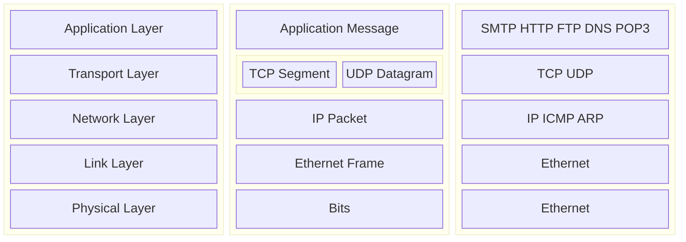

# CS3873 - Assignment 1

**Author:** Shahriar Kariman

*Due:* 2025-01-23

## Question 1 - Five Layers of the Internet Protocol Stack

The TCP/IP network model is a 5 layer model:

And the router processes the Network layer since it containes the information for source, destination and routing protocols.

## Question 2 - Sending a Packet over a Link

Here are some of the formulas from the slide I will be using a couple of them:

$$
\begin{split}

d_{nodal} = d_{proc} + d_{queue} + d_{trans} + d_{prop}

\\

d_{trans} = \frac{L_{bytes}}{R_{bps}}

\\

d_{prop} = \frac{d_{m}}{s_{m/sec}}

\end{split}
$$

And assuimng the processing and queueing delays are negligable then we can say:

$$
\begin{split}

d_{nodal} = d_{trans} + d_{prop} = \frac{2.3 \times 10^3}{100 \times 10^6} + \frac{10^6}{2.5 \times 10^8} = 4.02 \times 10^{-3} \ sec

\end{split}
$$

## Question 3 - E2E File Transfer With Different Throughput on Each Node

so we know $R_1 = 10 \ Mbps$, $R_2 = 25 \ Mbps$, $R_3 = 20 \ Mbps$.

### Part A

The total through put should be:

$$
\begin{split}

R = min(R_1, R_2, R_3) = 10 \ Mbps

\end{split}
$$

### Part B

$$
\begin{split}

d_{e2e} \approx \frac{P \times L}{R} = \frac{1 \times 250 \times 10^6 \times 8}{10^7} = 200 \ sec

\end{split}
$$

### Part C

With $R_1$ reduced to $5 \ Mbps$ and its the lowest among the nodes so the total throughput would now be equal to $5 \ Mbps$.

And I can easily reapproximate the time it takes to send the file from end to end.

$$
\begin{split}

d_{e2e} \approx \frac{P \times L}{R} = \frac{1 \times 250 \times 10^6 \times 8}{5 \times 10^6} = 400 \ sec

\end{split}
$$

Notice how the total delay is doubled and that is because the delay is inversely related to through.

$$
\begin{split}
d_{e2e} \propto \frac{1}{R_t}
\end{split}
$$

## Question 4 - E2E Same Rate Links

So this is very similar to the last question but the rates are the same.

$$
\begin{split}
R = 10^8 \ bps, \ \ N = 3, \ \ P = 100, \ \ L = 1.5 \times 10^3 \times 8 \ bits
\\
d_{e2e} = (P-1) \tau + N \tau = (P-1+N) \times \tau = (P+N-1) \times \frac{L}{R}=
102 \times \frac{1.5 \times 8}{10^5} = 1.2 \times 10^{-2} \ sec = 12 \ ms
\end{split}
$$

## Question 5

A packet is beeing sent between 2 nodes.

### Part A - $d_{trans}$

At the time $t = d_{trans}$ the last bit of the the packet is being sent meaning the last bit of the packet is technical still at host A.

### Part B - $d_{prop} > d_{trans}$

At time $t = d_{trans}$ the first bit of the packet is still in between the nodes since $d_{prop} > d_{trans}$.

### Part C - Arrival of the $1_{st}$ Bit

The first bit of the $2_{nd}$ packet will arrive at $t = d_{trans} + d_{prop} + \frac{1}{R}$.

$$
\begin{split}
d_{prop} = \frac{m}{s} = \frac{400}{2.5 \times 10^8} = 1.6 \times 10^{-6} \ sec
\\
d_{trans} = \frac{L}{R} = \frac{2 \times 10^3 \times 8}{10^7} = 1.6 \times 10^{-3} \ sec
\\
t = 1.6 \times 10^{-6} + 1.6 \times 10^{-3} + \frac{1}{10^7} = 1.6017 \times 10^{-3} \ sec
\end{split}
$$
